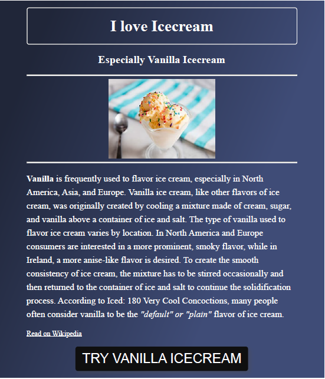
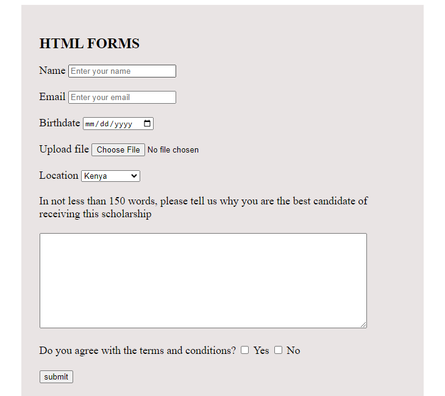

# Project Name
GLORIOUS MUIRURI Portfolio


## Description/Overview
I am currently pursuing a bachelor's degree in accountancy while honing my skills in software development. My journey into tech began with a deep interest in the ever-evolving world of technology, driven by the demand for tech skills and my long-term goal of becoming a software engineer. I balance my day studying accountancy and my nights self-teaching software development. Here, you'll find a showcase of my work, projects, and skills that demonstrate my journey and growth in the field of software development.


### Visuals

(img url)
(img url)
(img url)

#### Prerequisites

- Language: [e.g., Html,Css, JavaScript]
- Libraries: [e.g., Bootstrap]

##### Steps

1. Clone the repository:
    ```bash
    git clone https://github.com/gloriousNduta/portfolio_project.git
    ```
2. Install dependencies:
    ```bash
    npm install
    ```
3. Run the project:
    ```bash
    npm start
    ```

## Useful Resources

- [Resource 1](https://opemipocapstone.netlify.app/?authuser=0)[alt](url): Got my inspiration on the paths to follow while building my portfolio projectsince she was a member of the previous cohort and did the same project.

## Authors and Acknowledgments

- **Glorious Nduta** - *Initial work* - [Your GitHub](https://github.com/gloriousNduta)[alt](url)
- Special thanks to [Princess Maggy](https://github.com/PrincessMaggy)[alt](url) for [guiding me in building my project.].

## License

This project is licensed under the MIT License.


<!-- GLORIOUS MUIRURI Portfolio
Welcome to my portfolio! I'm Glorious, a passionate front-end developer with a background in accountancy. Here, you'll find a showcase of my work, projects, and skills that demonstrate my journey and growth in the field of software development.

Table of Contents
About Me
Skills
Projects
Education
Contact

About Me
I am currently pursuing a bachelor's degree in accountancy while honing my skills in software development. My journey into tech began with a deep interest in the ever-evolving world of technology, driven by the demand for tech skills and my long-term goal of becoming a software engineer. I balance my day studying accountancy and my nights self-teaching software development.

Skills
Programming Languages: JavaScript, HTML, CSS
Frameworks and Libraries: Bootstrap, RESTful APIs, Ajax
Tools and Platforms: Git, GitHub, Visual Studio Code
Other: Strong analytical skills, problem-solving, and a keen eye for details, communication skills and teamwork.

Projects
Project 1: Vanilla Webpage
Description: This project involved creating an engaging and visually appealing webpage about my favorite icecream flavor. The site features a historical overview, detailed ingredient lists, step-by-step recipes anf funfacts. Utilized HTML and CSS to deliver basic user-friendly experience. Designed to attract ice cream enthusiastis and home cooks, encouraging them to explore and share their love for vanilla icecream. 

Link: https://statuesque-seahorse-0a3d34.netlify.app/

Project 2: V-Weather-Project
 Developed a clean and intuitive weather application using vanilla Javascript. The application provides real-time weather updates and location-based weather information. Implemented features include dynamic weather icons, temperature conversion and user-friendly interface elements. Designed for optimal performance and accessibility, making it easy for users to stay informed about current weather conditions. This project demonstrates proficiency in front-end development and effective use of Javascript for interactive web applications.

Link: https://ndungu.netlify.app/

Project 3: Registration-Form-Project
   Created a clean and responsive user-registration form using basic HTML and CSS.The form includes fields for user information such as name, email, birthdate, location among others. Designed with a focus on usability, incorporating clear labels, placeholders and error messages for better user guidance. Ensured the form is visually appealing and accessible across various devices by implementing responsive design principles.

   link: https://stellular-cannoli-fff412.netlify.app/


Education
Bachelor's Degree in Accountancy
Technical University of Kenya, Year of Graduation-2025

Self-taught Software Development
HerTechtrail Academy cohort9 starter
Shecodes Basics, Shecodes Plus

Contact
I'm always open to new opportunities and collaborations. Feel free to reach out to me via:

Email: muiruriglorious@gmail.com
LinkedIn: https://www.linkedin.com/in/glorious-muiruri-2196a4269/
GitHub: https://github.com/GloriousNduta/
Thank you for visiting my portfolio! -->


